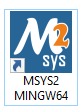

## Demo Video

[](https://www.youtube.com/watch?v=l2N1-HuA4dM)

Click the image above to watch the demo video.

# How to Use MSYS2 to Run a Remote Desktop Project
## Note: Use MSYS2 MINGW64


## BUILD INSTRUCTIONS

- Copy the ```lib``` folder and paste it into all 3 directories.
Commands to start the server:
- Start the MSYS2 software
  
- Navigate to the directory containing the makefile, Net folder, server folder, obj folder, and lib folder with the required libraries.
- Enter the command `make server` and press enter to build the server.
- Enter the command `./server.exe + port` to start the server and make it ready for connections.
  For example: `./server.exe 12345`

Commands to start the client:
- Start the MSYS2 software
  
- Navigate to the directory containing the makefile, Net folder, server folder, obj folder, bin folder, and lib folder with the required libraries.
- Enter the command `make` and press enter to build the client.
- Enter the command `./bin/client.exe` to start the client to connect to the machines.

## Here are the commands to install the libraries if you want to explore further. Please note that we have already included the necessary libraries for running the remote desktop in the lib folder.
- ### `pacman -Syu`: update all installed MSYS2 packages to the latest version

  - `-S`: option to install or update a package
  - `yu`: option to update all packages, including system and user-installed packages.

- ### `pacman -Su`: option to update all packages, including system packages.

- ### `pacman -S mingw-w64-x86_64-toolchain`

  - **mingw-w64-x86_64-toolchain**: provides the development tools to compile and run native C/C++ programs on Windows (prefer to use this over the next command).

- ### `pacman -S mingw-w64-x86_64-SDL2`
  - Used to download the SDL2 library.

- ### `pacman -S mingw-w64-x86_64-SDL2_image`
  - Used to download the SDL2_image library.

- ### `pacman -S mingw-w64-x86_64-opencv`
  - Used to download the opencv2 library.